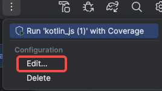
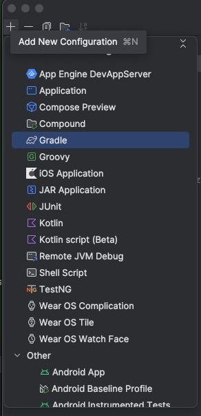
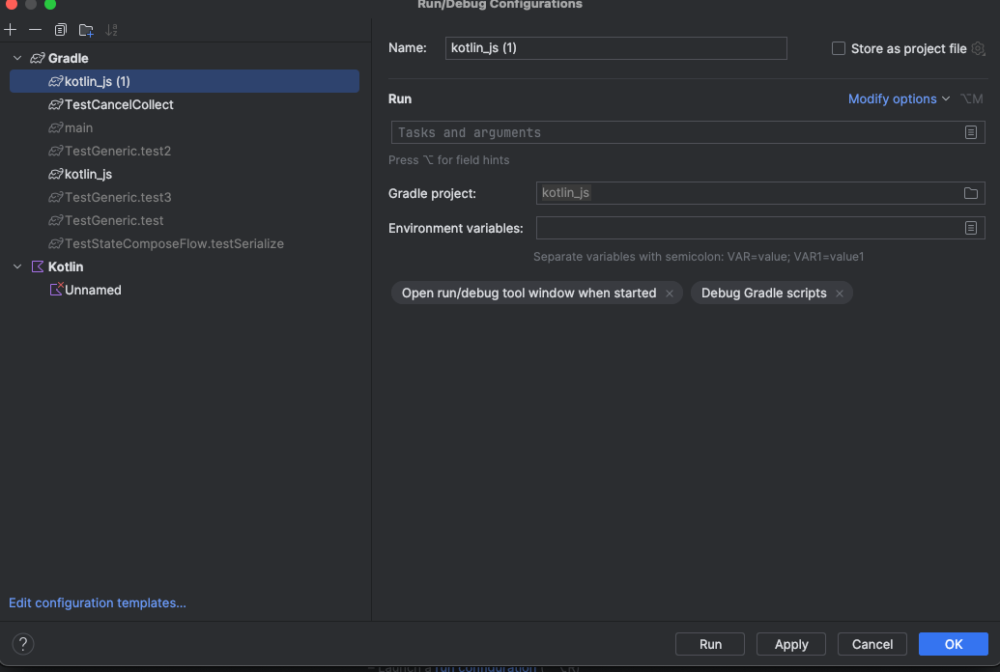

# 如何在 Android Studio 中添加一个运行配置，用来运行指定的单元测试

## 概述

- Kotlin/Js 工程
- 通过添加 Gradle 运行配置实现
- 以 jsNodeTest 运行
- 项目配置
  - build.gradle.kts
  ```
    plugin {
      kotlin("mutiplatform") version "1.9.20"
    }

    repositories {
        mavenCentral()
    }

    kotlin {
      js(IR){
        nodejs
      }
    }

  ```

## 配置







- Name: 运行的名称
- Run: 配置 
  - 运行全部的测试
    - 
  - 运行某一个文件中的全部测试
    - 
  - 运行文件中的某一个类
    -【:cleanJsNodeTest :jsNodeTest --tests "className.funName"】
  - 运行某一个具体的@Test函数
    - 
  
- Environment variables : 配置环境变量

:cleanJsNodeTest :jsNodeTest --tests "TestGeneric.test3"
