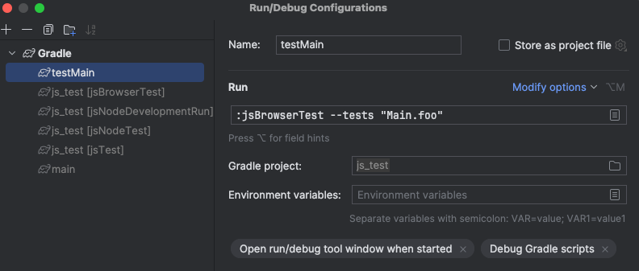

# 概述
- 通过 jsTest 实现单元测试的功能


# build.gradle.kts 
```kotlin
plugins {
    kotlin("multiplatform")
}

repositories {
    mavenCentral()
}

kotlin {
    js(IR){
        jsBrowser{
            binaries.executable()
            testTask{
              useKarma {
                // useChromeHeadless()
                // 表示在哪个浏览器中进行测试
                useChrome()
              }
            }
            sourceSets{
                val jsTest by getting{
                    dependencies{
                        implementation(kotlin("test"))
                    }
                }
            }
        }
    }
}

```

# *.kt
```kotlin
import kotlin.test.Test
import kotlin.test.assertEquals
import node.process.process
class TestClass(){
    @Test
    fun foo(){
        console.log("MainNodeJs foo")
        gradle.kts 中注入的环境变量
        assertEquals(1,2)
    }
}

class TestUI(){
  // 测试UI是否符合预期
  @Test
  fun ui(){
        val textContent = "1"
        val el = document.createElement("text")
        el.innerHTML = textContent
        el.setAttribute("id", "text-1")
        document.body?.append(el)
        val elText = document.querySelector("#text-1")
        assertEquals(elText != null, true)
        assertEquals(elText?.innerHTML, textContent)
        console.log(el.id)
//        assertEquals(elText?.innerHTML, "100")
        console.log(elText?.innerHTML)
  }
}

```

# 配置 run
- 如果@Test函数的左侧没有三角箭头出现
- 可以通过 Gradle 面板的 Tasks/verification/jsNodeTest 任务运行
- 也可以自己配置gradle run 脚本，实现指定的运行测试

- 如果测试文件是嵌套在目录中
- 通过修改 --tests 参数实现
- 例如
  - jsTest/kotlin/web/main.kt 里面的  class Main 的 foo 方法 的情况下；
  - 测试全部的
    - 执行 jsBrowserTest
  - 测试 main.kt 里面的 class Main
    - 配置 --tests "web.Main"
  - 测试 main.kt class Main 里面的foo 方法
    - 配置 --stest "web.Main.foo"


