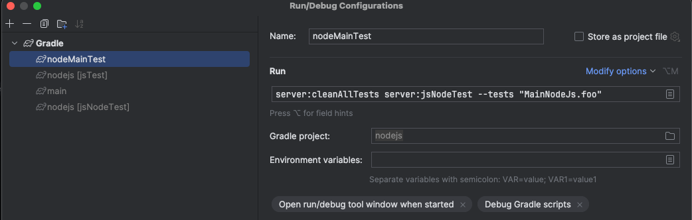

# 概述
- 通过 jsTest 实现单元测试的功能


# build.gradle.kts 
```kotlin
plugins {
    kotlin("multiplatform")
}

repositories {
    mavenCentral()
}

kotlin {
    js(IR){
        nodejs{
            binaries.executable()
            testTask{
              useMocha() // 还不清楚如何使用
              enviroment(key, value) // 注入环境变量
            }
            sourceSets{
                val jsTest by getting{
                    dependencies{
                        implementation(kotlin("test"))
                    }
                }
            }
        }
    }
}

```

# *.kt
```kotlin
import kotlin.test.Test
import kotlin.test.assertEquals
import node.process.process
class TestClass(){
    @Test
    fun foo(){
        console.log("MainNodeJs foo")
        console.log(process.env.key) // 获取build.gradle.kts 中注入的环境变量
        assertEquals(1,2)
    }
}

```

# 配置 run
- 如果@Test函数的左侧没有三角箭头出现
- 可以通过 Gradle 面板的 Tasks/verification/jsNodeTest 任务运行
- 也可以自己配置gradle run 脚本，实现指定的运行测试

- Run 配置
  - 若有目录需要把目录添加到 --tests 参数上
  - 例如 --test "node.TestClass.foo"
  - 对应的就是
    - jsTest/kotlin/node/main.kt文件中的 class TestClass 测试类里面的 foo 方法

