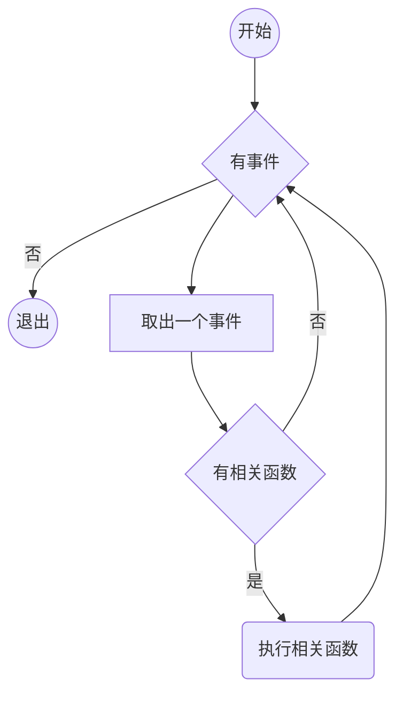
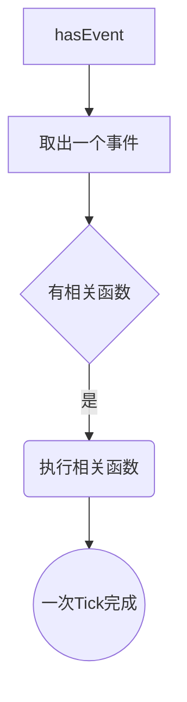

## Node 的异步I/O

---

#### 名词解释：

##### 事件循环

`Node 自身程序的执行模型， 采用的是观察者模式`
- 事件循环说明
  - 事件循环采用的是一个轮训机制， 在进程开始的时候启用
  - 每一次轮训是一个 Tick
  - 是一个典型的 `生产者/消费者模型`
  - 异步的 I/O 、 网络请求等是事件的生产者，这些事件会被传递到不同类型的事件观察者那么，事件循环则是从观察者哪里取出事件，并且处理；

 

##### Tick
`Node 事件循环中的一次过程`
- 一次 Tick 的过程




#####备注
- `javascript 是单线程`的，在前端 同 GUI 共同使用一个进程
- `node 是多线程`的，除了用户代码是同步执行的以外，所有的 I/O 都是`并行的`


---

## Node中其他的非异步API
- setTimeout() 放入定时器观察者
- setInterval() 放入定时器观察者
- process.nextTick() 会把函数 放入idel 观察者的队列中， 属于为micro task , 如果在主
- setImmediate()  会把函数放入 check 队列， 在异步操作有由于 timer 类型的而毁掉函数
` process.nextTick >  setImmediate`


```
这些定时器创建的时候会被放入，定时器观察者内部的红黑书上，每次Tick都会从定时器观察者上取出定时器对象
检查定时器是否超时，如果超时形成一个事件同时触发这个时间，调用定时器上的回调函数；
```
- 但是定时器的精确度不准确
- 因为是在每次Tick之中执行，如果上一次Tick执行的事件过长就会影响定时器回调的执行
- 实例说明
```
console.time()

// 会被放入 `定时器观察者内部的红黑树上` 等待下一次 Tick 的时候检查执行；
setTimout(()=>{
  console.log('我应该在0秒后立即执行，但是实际的执行时间是：')
  console.timeEnd()
},0)

// 延迟当前 Tick 执行的时间
for(let i = 0; i<1000; i++){
  console.log(i)
}

```
- 从实例上能够看到 setTimeout() 和 setInterval() 的时间精确度不够好

- 测试 优先级的代码
```
setImmediate(()=>{
  console.log('setImmediate')
})

process.nextTick(()=>{
  console.log('process.nextTick)
})

// 增加范围能够延迟下一次 Tick 的执行时间
for(let i=0;i<1;i++){
  console.log(i)
}

// output:
// 0
// process.nextTick
// setImmediate

```

- 测试 setImmediate() 一次Tick只调用链表中的一项
```
setImmedinate(()=>{
  consle.log('第一次Tick执行')
  process.nextTick(()=>{
    console.log('在第二次Tick中执行的process.nextTick')
  })
})

setImmediate(()=>{
  console.log('在第二次Tick中执行)
})

// 查看输入的顺序可以知道 immediate() 一次Tick 只执行一个
// 第一次Tick执行
// 在第二次Tick中执行的process.nextTick
// 在第二次Tick中执行

```

- 这样设计的策略是，为了保证每一轮的循环都能够尽快的结束，过多而阻塞 CUP

---

## 事件循环的机制

timers - 定时器回调阶段
pending callbacks - 执行 I/O 回调
idle prepare - idle 就是 process.nextTick()的回调函数
poll - 轮询阶段， 检索是否有新的 I/O 事件，
check - 检查阶段 执行 setImmediate() 的回调函数
close callbacks - 执行关闭导致的回调函数，例如 socket.on('close', callback)

```
在每一轮的 Tick 之间；
node.js 检查是否还有等待的计时器或I/O 回调，如果没有则完全关闭；
```

### Tick 每个阶段概述
#### timers
> 检查 定时器观察者，看是否有已经过期的定时器对象，如果有者执行这个定时器对象上绑定的回调函数
> 如果没有 Tick 进入 pending callback

#### pending callbacks
> 执行 延迟到下一个循环迭代的 I/O 回调
#### idle prepare 
>  
#### poll 
> 进入轮询阶段 检索是否有新的 I/O 事件； 执行与I/O 相关的回调？？？
> 1 计算应该阻塞和轮询 I/O 的事件
> 2 计算轮询队列里的事件
#### setImmediate

#### close callback

---

### 总结
- process.nextTick() 是一个微任务 不属于事件循环 的范畴 会立即执行
- Promise 是一个微任务，不属于事件循环的范畴，同样会立即执行，但是 会排在 process.nextTick 之后
- I/O 的执行收 持续时间的影响
- Immediate 立即执行，表示在当前事件循环中的末尾 立即执行，而且在 异步函数里注册的会优先于 timer 阶段的回调